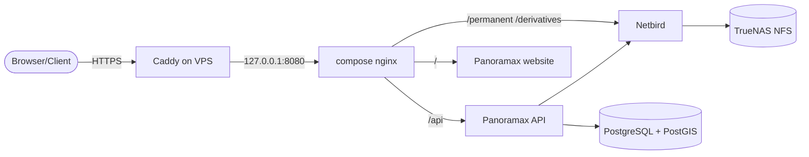
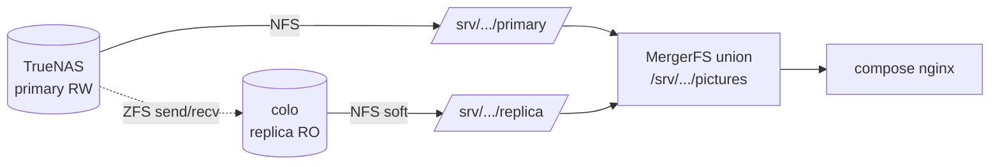

# spec — Panoramax Belgium

The *why* behind the design. For step-by-step install see [`DEPLOY.md`](./DEPLOY.md); for ongoing changes see [`OPERATIONS.md`](./OPERATIONS.md). For env-var reference, [`docker compose` semantics](https://docs.panoramax.fr/), and `panoramax_backend` CLI surface, follow the upstream Panoramax docs (linked inline).

## Overview

A single Infomaniak VPS hosts the Panoramax API + workers + database + website + image-serving via Docker Compose, fronted by host-level Caddy for TLS. Image storage lives on a remote on-prem TrueNAS, mounted into the VPS via NFS over a NetBird WireGuard mesh. Authentication is OSM OAuth2 only.

## Architecture

Only the VPS is reachable from the public internet. The TrueNAS share is only reachable via the vps as to not leak it's ip.

## Components

- **VPS (Infomaniak, NixOS)** — runs the Panoramax compose stack and Caddy.
- **Caddy on host** — TLS termination + HTTP→HTTPS + security headers. Native NixOS service, not in Docker, so TLS state survives container rebuilds.
- **Compose stack** — api + migrations + background-worker + website + db + reverseproxy (nginx). The `db` container is built locally from `Dockerfile.db` (postgis + pgbackrest); everything else is upstream images. See [`hosts/panoramax-osmbe/panoramax/docker-compose.yml`](./hosts/panoramax-osmbe/panoramax/docker-compose.yml).
- **TrueNAS** — image storage, NFS over NetBird. Two-layer auth (NetBird VPN + IP allowlist).

## NetBird

NetBird hosted free tier. Auto NAT traversal + identity-based peer ACLs are why we use it over raw WireGuard.

The mesh is purely meant for communication between the different servers; so VPS, TrueNAS (and if we in the future have a replica at some colocation). 

- The VPS NetBird IP is **auto-assigned on first connect** — it cannot be reserved in advance. The `panoramax.enable` toggle defaults to `false` so nixos-anywhere can install the base system cleanly: the operator gets a chance to verify NetBird has joined and the TrueNAS NFS mounts are reachable before the compose stack tries to start and set all IPs.
- ACLs live in the NetBird dashboard, not in Nix: VPS↔TrueNAS for NFS + sgblur and other things if needed.
- Verify direct (P2P) connections — relayed connections bottleneck NFS. The custom `netbird_peer_direct` Prometheus metric (textfile collector in [`modules/monitoring.nix`](./modules/monitoring.nix)) exposes per-peer P2P state.

## Storage

Two NFS child-dataset mounts (`/srv/panoramax/pictures/permanent` and `/srv/panoramax/pictures/derivates`) from TrueNAS over NetBird. Mount options: `soft,timeo=50,retrans=3,_netdev,nofail` — errors instead of hangs, and the system boots if the NAS is unreachable. The parent `/srv/panoramax/pictures` is a local directory so Docker can bind-mount the two children individually into the compose stack.

**Do not use `x-systemd.automount`.** Automount creates an empty mount point immediately, and Docker's bind mount can attach to that empty path before the actual NFS mount completes. `panoramax.service` has `RequiresMountsFor=/srv/panoramax/pictures/permanent /srv/panoramax/pictures/derivates` to refuse to start without the real mounts.

The VPS `panoramax` user has a fixed UID `1320` so it maps to a matching TrueNAS user for NFS identity-based access without relying on the `Other` ACL mask.

### Local disk layout

Infomaniak VPS Cloud instances ship two block devices: a ~20 GB OS volume and a ~250 GB data volume (their "expand a volume" model treats the data volume as the growable one). NixOS installs onto the OS volume — disko (see [`hosts/panoramax-osmbe/disko.nix`](./hosts/panoramax-osmbe/disko.nix)) partitions whichever disk the BIOS boots — and the 250 GB data volume is mounted at `/srv/panoramax` to hold everything that grows on local disk:

- the Docker data-root (`/srv/panoramax/docker`) — container images plus the `postgres_data` named volume, i.e. the database, which is the single largest local consumer;
- `tmp/` — the upload-processing scratch area (`FS_TMP_URL`), kept off NFS on purpose (see § Three-path FS mode);
- `pgbackrest/` — the local pgBackRest repo;
- `logs/`, and the `pictures/` parent directory that the two NFS child datasets mount under.

Keeping the OS volume small and everything stateful on the data volume matches Infomaniak's own layout: the data volume can be enlarged later (`parted` + `xfs_growfs`) without touching the OS install, and it survives an OS reinstall untouched (see below).

The data volume is mounted **by filesystem label** (`pano-data`, since xfs caps labels at 12 characters), not by `/dev/sdX`. Infomaniak's disk enumeration order is not guaranteed stable, so a device letter can resolve to the wrong disk between boots or reprovisions; a label always follows the correct filesystem. It is also mounted `nofail` (like the NFS mounts) so a missing data volume never hangs boot — `docker.service` and `panoramax.service` both carry `RequiresMountsFor=/srv/panoramax`, so the stack refuses to start rather than silently writing to the OS volume.

The data volume is deliberately **not** managed by disko. disko owns only the OS disk, so a `nixos-anywhere` reinstall repartitions the OS volume while leaving the 250 GB data volume — database, backups, in-flight uploads — intact. The data volume is formatted once by hand (`mkfs.xfs -L pano-data …`); see [`OPERATIONS.md`](./OPERATIONS.md#data-disk).

### `derivates` vs `derivatives`

Panoramax internally uses the French spelling `derivates` — the env var is `FS_DERIVATES_URL`, the on-disk directory is `derivates/`, and the dataset on TrueNAS is `derivates`. The **public URL** uses the English `/derivatives/`. The compose nginx provides an alias from `/derivatives/` to `/data/geovisio/derivates/` so externally-visible URLs stay English. Don't normalise either spelling.

### Three-path FS mode

We use the three-variable filesystem mode (`FS_TMP_URL`, `FS_PERMANENT_URL`, `FS_DERIVATES_URL`) instead of single `FS_URL`. Reason: `permanent/` and `derivates/` live on NFS, but `tmp/` lives on local disk so the upload-processing queue doesn't depend on NFS at all. The two modes are mutually exclusive in Panoramax — the upstream Dockerfile sets `ENV FS_URL=/data/geovisio`, so `env.public` deliberately sets `FS_URL=` empty to switch off single-path mode (the MapComplete deployment confirmed this is the right pattern).

## Colo replica (future, design only)

There is the idea of hosting the server at a colocation (possibly a hackerspace for example) where a copy of the pictures will eventually live, fed by ZFS replication from TrueNAS. The colo dataset would be exported read-only over NFS and mounted on the VPS using `soft + timeo` (so a colo outage doesn't hang the VPS). Compose-internal nginx would aggregate both backends via MergerFS, serving from whichever is healthy. **None of this is implemented.** No Nix code exists for it; We just wrote it down for future reference.

How it would behave: nginx reads only from the MergerFS union, so it doesn't care which backend served a given file. The `soft` mount on the replica means a colo outage returns I/O errors instead of hanging — MergerFS treats that backend as missing and reads fall through to the primary. Writes (uploads via the Panoramax API/workers) bypass MergerFS entirely and go straight to the TrueNAS NFS mount used by the rest of the stack; ZFS replication propagates them to the colo asynchronously.

## Authentication

OSM OAuth2 only. No Keycloak.

- Application registered at `https://www.openstreetmap.org/oauth2/applications`.
- Redirect URI: `https://panoramax.osm.be/api/auth/redirect`.
- Permission scope: "Read user preferences".
- `OAUTH_CLIENT_ID` and `OAUTH_CLIENT_SECRET` live in sops, not in `env.public`.

## DNS

A + AAAA records for `panoramax.osm.be` and `images.panoramax.osm.be`, both pointing to the VPS today. The `images.` subdomain is meant for futureproofing if we ever decide to put the images on a different server, then we can just have that subdomain point to the other server. DNS is managed in the `osmbe/dns` repo via PR (out-of-band of this flake).

No public DNS for TrueNAS or the future colo replica. The VPS only connects to internal peers over NetBird.

## Backups

Three independent copies.

| # | Tool | Location | Frequency |
|---|---|---|---|
| 1 | pgBackRest | local disk on VPS | hourly incr. + weekly full |
| 2 | BorgBackup | BorgBase, append-only | daily |
| 3 | pg_dump (logical) | Hetzner Object Storage | daily, with weekly + monthly server-side copies |

Why three: pgBackRest is fast and PITR-capable but physical, so any in-place corruption replicates byte-for-byte. Borg backs up the *pgBackRest repo* — same chain, different geography, append-only. pg_dump is the corruption canary: it reads through the query engine, so silent corruption fails loudly. It's also portable across major versions.

BorgBase append-only is **delayed deletion**, not strict immutability — the server can mark archives for deletion, but actual purges happen on a schedule (manual or 2-weekly via the BorgBase dashboard).

S3 lifecycle rules (daily 7d, weekly 30d, monthly 365d) are applied once via `s3cmd setlifecycle` (see [`DEPLOY.md`](./DEPLOY.md)). **Object Lock is disabled** — it conflicts with tiered retention.

For the disaster-recovery procedure see [`OPERATIONS.md`](./OPERATIONS.md#disaster-recovery).

## Monitoring

Metrics and dashboards live in **Grafana Cloud**. Prometheus scrapes `node_exporter` on the VPS over NetBird; Grafana Cloud queries that Prometheus. Logs ship to **Grafana Cloud Loki** (free tier) over public TLS with basic auth via **Grafana Alloy** (Grafana Cloud expects User ID + access-policy token, not bearer), so log access survives even when the VPS is down. Grafana Cloud adds Loki as a data source.

Docker is configured with `log-driver = "journald"` (see [`modules/common.nix`](./modules/common.nix)), so every container's stdout/stderr lands in the systemd journal tagged with `CONTAINER_NAME`. Alloy's journal scrape relabels that field to a Loki `container` label, giving queries like `{host="panoramax-osmbe", container="panoramax-api"}` for free. Trade-off accepted: journal fills faster, so the cap is bumped to 2 GB.

Ground-truth alerting (separate from the dashboards) goes via [Healthchecks.io](https://healthchecks.io). The three 5-minute checks (`heartbeat`, `nfs-health`, `truenas-heartbeat`) use **Simple** mode (period-based, interval since last ping) because their systemd timers fire every 5 min from boot and aren't aligned to wall-clock minutes. The scheduled checks (`pgbackrest`, `borgbackup`, `pgdump-s3`, `flake-update`, `nixos-upgrade`) use **Cron** mode because they're expected at specific UTC times and you want "the Sunday 03:30 run didn't happen" to alert, not "more than gracedays passed since last ping". Auto-upgrade is non-rebooting; admins reboot manually after the `BUILD SUCCEEDED — REBOOT REQUIRED` alert — accepted trade-off is one possible false-alert per admin reboot if it runs longer than the 10-min grace. Ping URLs live in sops; every healthchecks `curl` ends in `|| true` so the service stays green if Healthchecks itself is down — *the missed ping is the alert*. The VPS runs on UTC (`time.timeZone = "UTC"` in `common.nix`) so timer expressions, journal timestamps, and Healthchecks all share the same wall clock.

External uptime monitoring uses [UptimeRobot](https://uptimerobot.com) and a self-hosted [Uptime Kuma](https://uptime.kuma.pet) — two independent monitors so a single tool's outage doesn't blind us. Both check `panoramax.osm.be` API + website + TLS expiry. The `images.` check is disabled today (same VPS as `panoramax.`); it will be turned on when image serving moves to a separate host.

## Secrets

Two-repo split, attached as a git submodule:

- **`panoramax-configs`** (this repo, public) — Nix + compose + docs + plaintext templates. Registers `secrets/` as a submodule via `.gitmodules`.
- **`panoramax-secrets`** (private, attached at `./secrets/`) — sops-encrypted YAML, the `.sops.yaml` policy, and any topology metadata that should not be public.

### Why a submodule (not just two adjacent clones)

Nix flake source-resolution uses `git ls-files` semantics: anything under a gitignored path is invisible to flake evaluation, *even if the file exists on disk*. An earlier draft of this layout had `secrets/` in `.gitignore` with the private repo cloned into it side-by-side, and flake-eval silently fell back to the plaintext dummy on every build — including real deploys. A submodule fixes this on three fronts at once:

1. **Visibility.** With `?submodules=1` on the flake URL, Nix copies the submodule's working tree into the source. `builtins.pathExists ./secrets/panoramax-osmbe.yaml` returns true, the real file gets used, dummy fallback only kicks in for fresh clones (where the submodule isn't initialised).
2. **No accidental commits.** Once `secrets/` is a registered submodule, git refuses `git add secrets/<anything>` from the parent — only the gitlink SHA can be recorded. The encrypted-file bytes never enter the public repo's history. (`secrets/` no longer needs to be in `.gitignore`; submodule semantics protect it inherently.)
3. **Pinning.** The parent records *which commit* of the secrets repo it expects. A flake-lock equivalent for secrets — important when rolling back a config change that depended on a specific secret being present.

### Fallback for fresh clones

A plaintext `secrets-dummy.yaml` lives in the public repo. The flake transparently uses it when `./secrets/panoramax-osmbe.yaml` is absent (submodule not initialised). This keeps `nix flake check` green for CI and contributors who don't have access to the private repo. Sops file *validation* is also disabled in the dummy path; the real file always validates. Real deploys must use `?submodules=1` on the flake URL so Nix sees the encrypted secrets; a forgotten submodule results in the stack starting with placeholder credentials, which is why every rebuild command includes `?submodules=1`.

### Crypto + decryption

Encryption is age-based, with the host's SSH ed25519 key (converted via `ssh-to-age`) plus one age key per admin as recipients. Decryption uses `/etc/ssh/ssh_host_ed25519_key` via `sops.age.sshKeyPaths`. All secrets are mode `0400`, owner root.

The host SSH key is **pre-generated locally** before nixos-anywhere and injected at install time via `--extra-files` — otherwise the host can't decrypt the secrets at first boot.

### VPS access to the private repo

The VPS **never auto-pulls the private secrets repo**. Auto-pulling would expose the encrypted history of past secrets if the VPS is compromised. The submodule is updated manually via SSH agent forwarding: the operator SSHes in with `-A`, then runs `git submodule update --remote secrets` to pull the latest pinned commit. The VPS holds no permanent credential for `panoramax-secrets`.

The BorgBase repo URL and host key live in sops on purpose — to avoid disclosing which BorgBase repo we use from the public GitHub repo.

After secret rotation, services that consume the rotated secret must be **manually restarted** (`nixos-rebuild switch` updates `/run/secrets/` but does not restart units). See [`OPERATIONS.md`](./OPERATIONS.md#secret-rotation).

## Security model

Public attack surface on the VPS:

- TCP 80, 443 (Caddy → compose nginx → api/website).
- TCP `instance.sshPort` (sshd, currently `58422` — moved off 22 for cheap bot-noise reduction).

Not exposed publicly:

- Postgres (5432) is bound by Docker to `127.0.0.1:5432:5432` — never `0.0.0.0`. Admin access is via SSH local port forward; no other host can route to it. See [`OPERATIONS.md` § Connecting to Postgres](./OPERATIONS.md#connecting-to-postgres).
- node_exporter (9100) is scoped to the `wt0` interface via firewall.

Host hardening:

- `mutableUsers = false`; admin user has multiple authorised SSH keys.
- Root SSH disabled; password and keyboard-interactive auth disabled.
- Modern crypto only (`KexAlgorithms`, `Ciphers`, `MACs` all curve25519/ChaCha20/AES-256-GCM family).
- fail2ban with bantime increment (1h baseline, doubling).

## Deployment model

A flake repo. `nixos-rebuild switch --flake '.?submodules=1#panoramax-osmbe'` applies changes (`?submodules=1` so Nix sees the secrets submodule — see § Secrets). The `panoramax.enable` toggle gates the entire compose stack so nixos-anywhere can install the base system cleanly before the operator validates that Netbird and NFS are healthy. The compose env is built fresh at each unit start from `env.public` + decrypted sops fragment via `panoramax-env-merge.service`. File changes in `hosts/panoramax-osmbe/panoramax/*` propagate via `environment.etc."panoramax/..."` mirroring + `reloadTriggers`, so editing nginx.conf and rebuilding triggers a `docker compose up`.

Auto-upgrade design — disabled by default, enable via `panoramax.autoUpgrade.enable = true` once the instance has been stable for at least a week:

- Sunday 03:30 UTC: `flake-lock-update.service` updates `flake.lock`, commits with a `panoramax-auto-upgrade` git identity, and pushes to the `prod` branch using a deploy key from sops. If pushing fails (remote moved), Healthchecks gets a `/fail` ping with the git output — no auto-resolve.
- Sunday 04:30 UTC: `nixos-upgrade.service` does `nixos-rebuild switch` from the committed lockfile on `prod`. Rebuild output (last 20 lines on success, full log on failure) goes into the Healthchecks ping body.
- **Reboot is deliberately not automatic.** When `booted != built` after the rebuild (kernel/initrd/modules changed), the unit writes `/var/lib/nixos-upgrade/reboot-pending` and posts a `/fail` ping with body `BUILD SUCCEEDED — REBOOT REQUIRED ...`. An admin SSHes in at their convenience and runs `sudo reboot`. The motivation is to fail loud, not surprise — a borked kernel that won't boot is far less recoverable than a stale-by-a-day kernel.
- On next boot, `nixos-upgrade-postboot.service` (oneshot, after `network-online.target`) checks the sentinel + `booted == built`; if both hold, it deletes the sentinel and pings success → check goes green. If the box never comes back, no success ping fires and the alert stays loud — which is exactly what you want.
- Heartbeat and nfs-health are hc.io Simple-mode checks (Period 5 min, Grace 10 min) — no blind-spot. With manual reboots there's no scheduled gap to dodge; the trade-off is a possible one-off false-alert per reboot if it runs longer than the 10-min grace.

The `prod`/`main` split lets the operator stage flake-lock bumps before promoting (`git merge --ff-only main` into `prod`). Auto-upgrade does **not** pull new Docker images; image bumps remain a manual concern.

## CI

`.github/workflows/nix-check.yml` runs `nix flake check` on push and PR using the DeterminateSystems nix-installer + magic-nix-cache actions. The dummy secrets fallback is what lets this run without access to the private repo.

## Appendix: confusing names worth knowing

- **`ssl-api`** — the upstream container command for the API. Despite the name, the container itself does **not** terminate TLS. It's a Waitress WSGI server with `--url-scheme=https` and `--trusted-proxy '*'`, expecting upstream X-Forwarded-* from Caddy + nginx. TLS lives on Caddy.
- **`PICTURE_WORKERS_REPLICATS`** — yes, with the typo. That's the spelling upstream uses (in `docker/full-osm-auth/docker-compose.yml` and `example.env`). No Python code reads it; it's a Compose-native `replicas` key. Don't "fix" the typo — it'll silently break.
- **`API_REGISTRATION_IS_OPEN`** — federation flag only. Does **not** gate registration.
- **`API_FORCE_AUTH_ON_UPLOAD`** — must be the lowercase string `"true"`. Source code does `== "true"` (case-sensitive); `True` reads as false.
